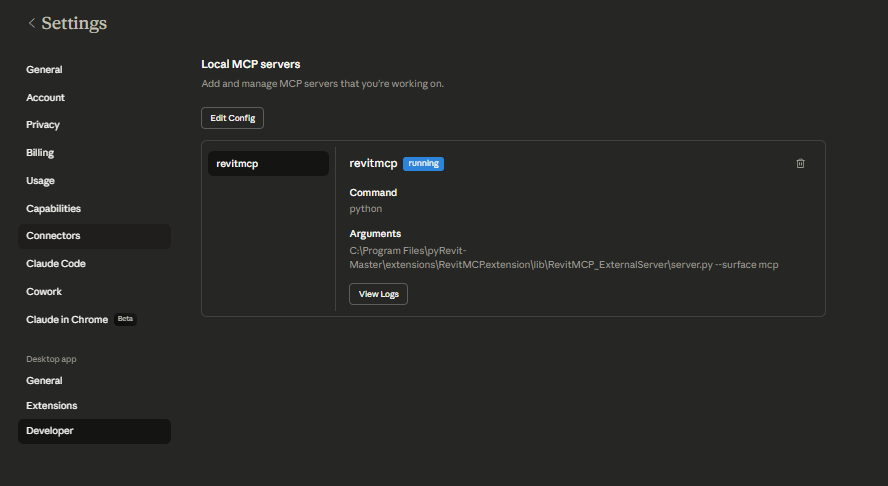

# RevitMCP

RevitMCP is a pyRevit extension plus a Python server that lets AI clients work against a live Revit session.

It supports two ways to use it:

*   Web UI at `http://127.0.0.1:8000`
*   Claude Desktop local MCP over stdio

Repository layout note: this repository root is the pyRevit extension root. If you install from source manually, the checkout directory itself should be named `RevitMCP.extension`.

## Tools

RevitMCP exposes 22 tools:

| Tool | Description |
| --- | --- |
| `get_revit_project_info` | Get active project metadata, document path, and Revit version details |
| `get_active_view_info` | Read the current view's name, type, scale, and related metadata |
| `get_active_view_elements` | Capture a bounded snapshot of elements visible in the active view |
| `get_active_selection` | Read the current Revit selection as a reusable result set |
| `list_family_types` | List loaded family types with category, family, type, and symbol IDs |
| `get_revit_schema_context` | Load canonical Revit schema context including levels, categories, families, types, and common parameters |
| `resolve_revit_targets` | Resolve user terms to exact Revit category, level, family, type, and parameter names |
| `get_revit_memory_context` | Load persistent local user/project notes for recurring Revit conventions and workflow hints |
| `save_revit_memory_note` | Save a persistent local user/project note for future chats and tool runs |
| `get_elements_by_category` | Retrieve all elements for a category and store the result for follow-on actions |
| `select_elements_by_id` | Select elements by explicit IDs or a stored result handle |
| `select_stored_elements` | Select a previously stored search or filter result inside Revit |
| `list_stored_elements` | List stored element result sets and their counts currently available on the server |
| `filter_elements` | Find elements by category, level, and parameter-based conditions |
| `filter_stored_elements_by_parameter` | Refine a stored result set with batched server-side parameter filtering using one or many target values |
| `get_element_properties` | Read parameter values for specific elements or an existing result handle |
| `update_element_parameters` | Update one or many element parameters with typed value handling |
| `place_view_on_sheet` | Create a new sheet, auto-number it, and place a matched view on it |
| `list_views` | List views that can be placed on sheets, including type and placement status |
| `analyze_view_naming_patterns` | Cluster view names by type and flag likely naming outliers |
| `suggest_view_name_corrections` | Generate rename suggestions from a prior view naming analysis |
| `plan_and_execute_workflow` | Execute a multi-step Revit workflow from a structured tool plan |

## Requirements

*   Autodesk Revit
*   pyRevit
*   Python 3.7+ available as `python` if you want to run the external server directly or through Claude Desktop
*   A Revit project open while using RevitMCP

## Surface Modes

RevitMCP has two server surfaces:

*   `web`: browser UI at `http://127.0.0.1:8000`
*   `mcp`: stdio server for Claude Desktop

One `server.py` process runs one surface at a time.

To switch manually:

```powershell
python lib\RevitMCP_ExternalServer\server.py --surface web
python lib\RevitMCP_ExternalServer\server.py --surface mcp
```

If you use the pyRevit launcher, it reads the preferred surface from:

`%USERPROFILE%\Documents\RevitMCP\user_data\revitmcp_settings.json`

```json
{
  "preferences": {
    "server_surface": "web"
  }
}
```

If you want both the Web UI and Claude Desktop at the same time, they need to run as separate processes.

## Install RevitMCP

1.  Install pyRevit: [pyRevit installer](https://pyrevitlabs.io/docs/pyrevit/installer)
2.  Choose one of these pyRevit extension roots:
    *   `%APPDATA%\pyRevit\Extensions`
    *   `%PROGRAMDATA%\pyRevit\Extensions`
3.  Clone this repository directly into a folder named `RevitMCP.extension` under that root:

```powershell
git clone https://github.com/oakplank/RevitMCP.git "%APPDATA%\pyRevit\Extensions\RevitMCP.extension"
```

4.  If you download a ZIP instead, extract the repository contents into a folder named `RevitMCP.extension` under the same extension root.
5.  Reload pyRevit or restart Revit.

The folder name matters: pyRevit discovers extensions by folders that end with `.extension`.

## Enable Revit Routes

1.  Open Revit.
2.  Go to `pyRevit -> Settings`.
3.  Enable the Routes server.
4.  Restart Revit.
5.  Allow firewall access if Windows asks.

The default Revit Routes port is usually `48884`.

## Quick Start: Web UI

1.  Open a Revit project.
2.  In Revit, click `RevitMCP -> Server -> Launch RevitMCP`.
3.  Open `http://127.0.0.1:8000`.
4.  Add any required model or API settings in the web UI.
5.  Try: `Get Revit project info`

## Quick Start: Claude Desktop

1.  Install Claude Desktop: `https://claude.ai/download`
2.  In Claude Desktop, go to `Settings -> Developer -> Local MCP Servers -> Edit Config`.
3.  Add `revitmcp` to your Claude config.

If your Claude config already exists, keep your current `preferences` and other MCP servers. Only add `revitmcp` under `mcpServers`.

If you copy the full example below, update the `preferences` values to match your own Claude Desktop setup.

```json
{
  "mcpServers": {
    "revitmcp": {
      "command": "python",
      "args": [
        "C:\\Program Files\\pyRevit-Master\\extensions\\RevitMCP.extension\\lib\\RevitMCP_ExternalServer\\server.py",
        "--surface",
        "mcp"
      ]
    }
  },
  "preferences": {
    "chromeExtensionEnabled": true,
    "coworkScheduledTasksEnabled": true,
    "ccdScheduledTasksEnabled": true,
    "sidebarMode": "chat",
    "coworkWebSearchEnabled": true
  }
}
```

4.  Replace the example `server.py` path with the actual path on your machine.
5.  If `python` does not work, replace it with the full path to `python.exe`.
6.  Save the file and fully restart Claude Desktop.
7.  Re-open `Settings -> Developer -> Local MCP Servers` and confirm `revitmcp` shows `running`.
8.  Try: `Get Revit project info`

Expected Claude Desktop screen after `revitmcp` is configured:



## Troubleshooting

### `revitmcp` does not show in Claude Desktop

*   Check that your Claude config is valid JSON.
*   Make sure the `server.py` path is absolute and exists.
*   If `python` is not found, use the full path to `python.exe`.
*   Fully quit Claude Desktop from the system tray and reopen it.
*   Check `%APPDATA%\Claude\logs`.

### Claude Desktop can see `revitmcp` but tools do not work

*   Make sure Revit is open with a project loaded.
*   Make sure pyRevit Routes is enabled.
*   Restart Revit after enabling Routes.
*   Open `View Logs` for `revitmcp` in Claude Desktop.

### Web UI or server startup issues

*   Check `%USERPROFILE%\Documents\RevitMCP\server_logs`
*   Startup log: `server_startup_error.log`
*   App log: `server_app.log`
